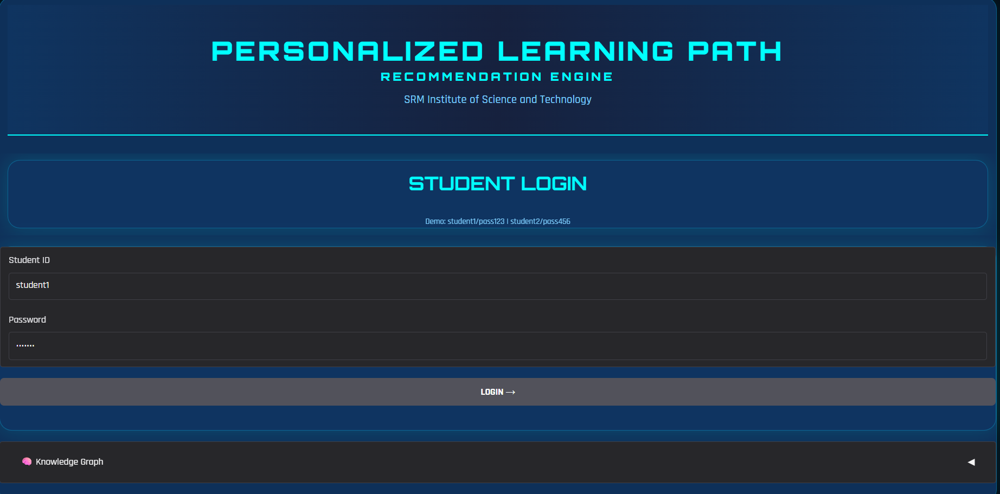
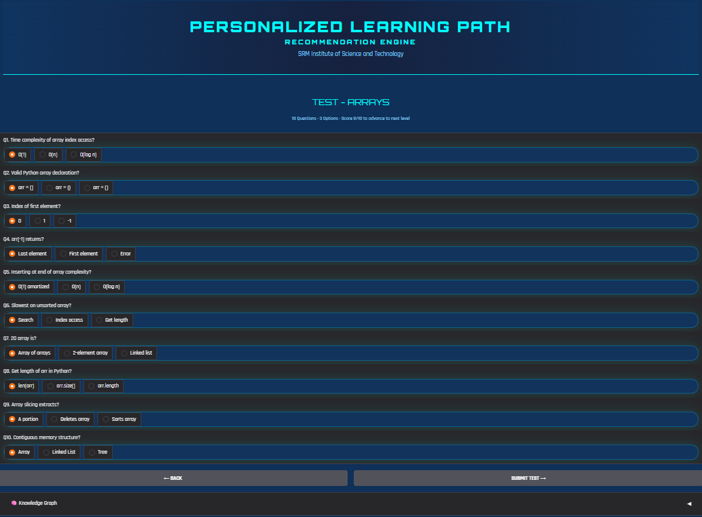
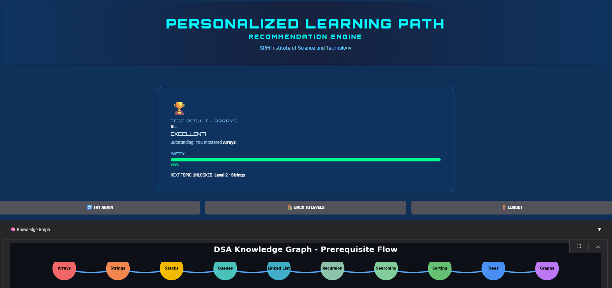

# Personalized Learning Path Recommendation System

## Overview
This project presents a Personalized Learning Path Recommendation System designed to guide learners through Data Structures and Algorithms (DSA) topics based on their performance. The system analyzes learner scores and suggests the most appropriate next topic, ensuring a structured and adaptive learning experience.

---

## Methodology
The system combines rule-based logic with similarity analysis:

- Score ≥ 8 → Advance to next topic  
- Score ≥ 5 → Repeat current topic  
- Score < 5 → Remedial learning  

Cosine similarity is used to analyze relationships between topics and support the recommendation process.

---

## Technologies Used
- Python  
- Pandas  
- NumPy  
- Scikit-learn  
- Google Colab  

---

---

## How to Run
1. Open `main.ipynb` in Google Colab  
2. Upload the dataset or use the Kaggle link  
3. Run all cells to generate recommendations  

---

## System Outputs

### Login Interface

### Assessment Interface

### Recommendation Output

---

## Conclusion
The system provides an efficient approach to personalized learning by combining rule-based decision logic with similarity analysis. It ensures structured topic progression while adapting to learner performance.

---

## Author
Done by Rithanya M

